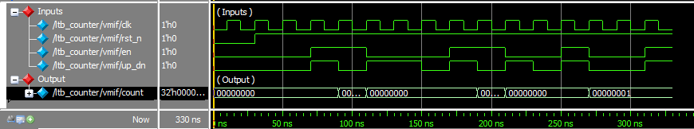
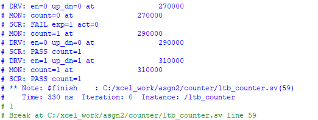
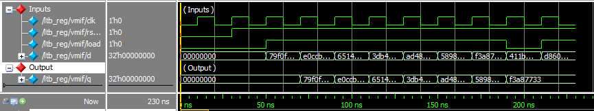
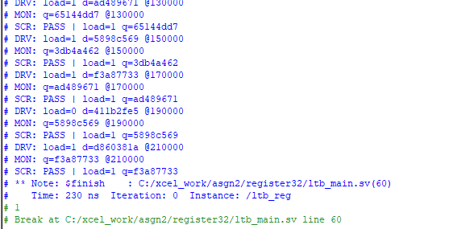
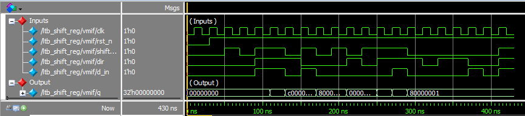
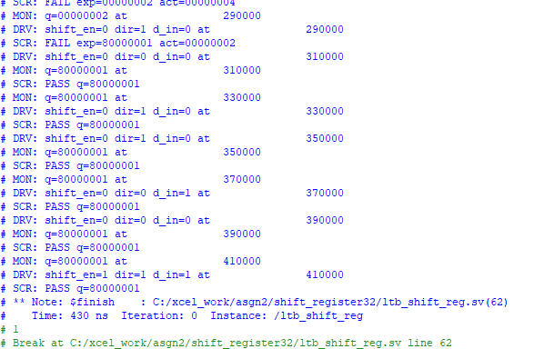
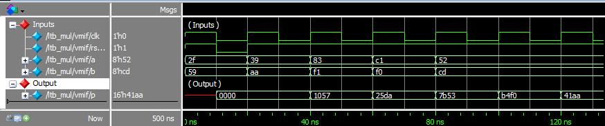
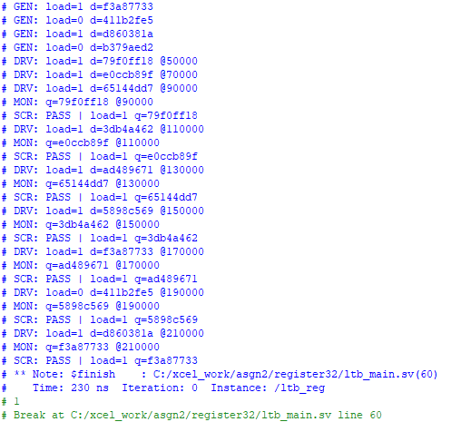

# TASK 2: Sequential Circuits Design & Layered Verification  
**[XCELERIUM IC DESIGN TRAINING AND INTERNSHIP]**

## Author  
**Hammad Qamar (EL-22074)**  
Electronics Department  
NED University of Engineering & Technology, Karachi  

---

## Overview  
This repository contains the implementation and verification of **sequential digital circuits** developed as part of **Task 2** of the **Xcelerium IC Design Training and Internship** program.

The task focuses on:
- RTL design of **clocked sequential circuits**
- **Layered, class-based verification** using SystemVerilog
- Practical understanding of **SystemVerilog OOP concepts**

This task extends Task 1 by introducing state-based designs and a structured verification environment.

---

## Implemented Sequential Modules  

### Design (RTL)
The following sequential circuits are implemented:

- **Counter**
- **Register**
- **Shift Register**
- **Multiplier (Input/Output Registered)**

### Multiplier Architecture  
The multiplier design includes **two different implementations**:
- **Array Multiplier**
- **Adder Tree Multiplier**

Both architectures are supported through a common top-level module **`mul_main`**, allowing either implementation to be instantiated while keeping the interface and verification environment unchanged.

---

## Verification Methodology  

A **layered testbench approach** is used instead of simple procedural testbenches.

### Testbench Components  
Each module is verified using class-based components:

- **Transaction (Sequence Item)**
- **Generator**
- **Driver**
- **Monitor**
- **Scoreboard**

### Verification Features  
The testbenches include:
- Random stimulus generation using `rand`
- Mailbox-based communication
- Input and output assertions
- Self-checking scoreboard
- Clock and reset handling
- Transcript-based result checking
- Waveform inspection

> This verification environment is not full UVM, but it is intentionally designed for **learning SystemVerilog OOP concepts** such as mailboxes, randomization, assertions, and component interaction.

---

## Simulation Results  

Simulation results include **waveforms** and **simulation transcripts** for each module.

### Counter Simulation  
  

---

### Register Simulation  
  

---

### Shift Register Simulation  
  

---

### Multiplier Simulation  
  

> Both **Array Multiplier** and **Adder Tree Multiplier** were verified using the same layered testbench through the `mul_main` module.

---

## Tools & Language  

- **SystemVerilog (RTL + Verification)**
- **RTL Simulation:** ModelSim / QuestaSim compatible
- **Verification Style:** Directed + Randomized, Layered Testbench

---

## Learning Outcomes  

This task provided hands-on experience with:
- Sequential circuit design
- Clocked RTL behavior
- Layered verification architecture
- SystemVerilog features:
  - OOPs
  - `rand` variables
  - Mailboxes
  - Assertions

---

## Notes  

- The verification environment is designed for **educational purposes**
- Emphasis is on understanding **verification flow and OOP concepts**
- This task serves as a foundation for more advanced methodologies such as UVM

---
